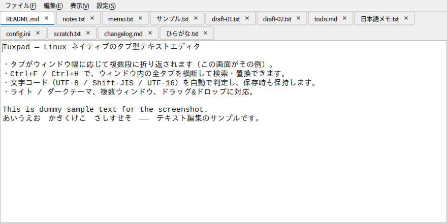

# Tuxpad

[](https://github.com/boby3110-jpg/Tuxpad/actions/workflows/tests.yml)

Wine + EmEditor に頼らず、Linux ネイティブで動くシンプルなタブ型テキストエディタ。
日本語のテキストファイルを扱うことを前提にしています。

実装スタックは **Python + PySide6 (Qt for Python)**。



## 目指す機能

1. 新規作成
2. 開く
3. 保存 / 上書き保存
4. タブにファイル名を表示（未保存マーク・閉じるボタン付き）
5. タブをウィンドウ幅に応じて複数段に折り返し表示（独自タブバーをフルスクラッチ実装）
6. `Ctrl+F`：ウィンドウ内の全タブを横断して検索
7. `Ctrl+H`：ウィンドウ内の全タブを横断して検索・置換
8. 文字コードの自動判定・保持（UTF-8 / Shift-JIS / UTF-16 など）

シンタックスハイライトや大容量ファイル最適化は対象外です（「シンプルなエディタ」が目標）。

## セットアップ

**日本語入力 (IME) やネイティブファイルダイアログを使うには、pip 版ではなく
OS パッケージマネージャで入れたシステム版 PySide6 が必要です。** pip 版
PySide6 は自前の Qt 一式を同梱しており、fcitx5 用 Qt6 プラグインや KDE の
プラットフォームテーマとプライベート ABI が一致せず読み込めないためです。

### 自動インストール（推奨）

```bash
git clone <このリポジトリ> tuxpad && cd tuxpad
./install.sh
```

`install.sh` が `/etc/os-release` からディストリビューションを判別し、

1. システム版 PySide6・charset-normalizer・Qt 実行時ライブラリを
   apt / dnf / pacman / zypper で導入
2. `python3 -m venv --system-site-packages .venv` を作り、開発依存（pytest 等）を導入
3. 起動ラッパー `~/.local/bin/tuxpad` と `~/.local/share/applications/tuxpad.desktop`
   を、この clone の絶対パスで生成

まで行います。何度実行しても壊れません（冪等）。主なオプション:

| オプション | 意味 |
| --- | --- |
| `--print-plan` | 何も変更せず、判別結果と導入予定パッケージだけ表示 |
| `--dry-run` | 実行するコマンドを表示するだけ |
| `--desktop-only` | ランチャーと `.desktop` だけ作り直す（clone を移動した後など） |
| `--no-desktop` | ランチャーと `.desktop` を作らない |
| `--allow-pip-pyside6` | システム版が無いとき pip 版で代替（**IME は使えなくなる**） |
| `--bin-dir` / `--desktop-dir` | 生成先を変える（既定は `~/.local/bin`・`~/.local/share/applications`。相対パスで渡しても絶対パスに直します） |

システム版 PySide6 が見つからない場合、`install.sh` は**黙って pip 版を入れずに
中断**します（IME が使えない構成に気づかず移行するのを防ぐため）。

### ディストロ別のパッケージ名

`install.sh` が選ぶパッケージは以下です（`./install.sh --print-plan` で確認できます）。

| ディストロ | PySide6 | charset-normalizer | Qt 実行時ライブラリ | 実機での確認 |
| --- | --- | --- | --- | --- |
| Debian / Ubuntu (apt) | `python3-pyside6.qtcore` `.qtgui` `.qtwidgets` `.qtnetwork` | `python3-charset-normalizer` | `libegl1` `libgl1` `libxkbcommon0` `libdbus-1-3` `libfontconfig1` `libxcb-cursor0` | ✅ Debian 13 |
| Fedora / RHEL 系 (dnf) | `python3-pyside6` | `python3-charset-normalizer` | `mesa-libEGL` `libglvnd-glx` `libxkbcommon` `dbus-libs` `fontconfig` `xcb-util-cursor` | ✅ Fedora 44（IME まで） |
| Arch 系 (pacman) | `pyside6` | `python-charset-normalizer` | `libxkbcommon` `xcb-util-cursor` `fontconfig` | ✅ EndeavourOS |
| openSUSE (zypper) | `python313-pyside6`（Python のバージョンに追従） | `python313-charset-normalizer` | `libgthread-2_0-0` `libxkbcommon0` `libxcb-cursor0` `fontconfig` | ⚠ 開発機で常用（`install.sh` 自体は未実行） |

`--dev` を付けたときは、上記に加えてテスト用のパッケージも入ります
（Debian/Ubuntu のみ `python3-pyside6.qttest`。他のディストロは PySide6 が
全部入りなので追加不要です）。

Debian/Ubuntu の PySide6 はモジュールごとに分割されています。単一インスタンス化に
QtNetwork を使うため `.qtnetwork` も必須です。

**注意（Debian/Ubuntu）**: PySide6 のパッケージは **Debian 13 (trixie) /
Ubuntu 25.04 以降**にしかありません。**Ubuntu 24.04 (noble) には
`python3-pyside6.*` は無く**、PySide2 (Qt5) しか入っていません。24.04 で使う場合は
新しいリリースへ上げるか、`--allow-pip-pyside6`（IME 不可）を選ぶことになります。

apt / dnf / pacman の 3 系統は、実機で `./install.sh` を流して確認済みです
（2026-08）。Fedora 44 は日本語入力 (IME) まで、Debian 13 / EndeavourOS (Arch) は
導入とシステム版 PySide6 の動作までを見ています。**openSUSE (zypper) だけは
`install.sh` 自体を流した確認が未了**で（開発機で常用してはいます）、導入時に
「パッケージ名の確認が未了です」という注意書きが出ます。

ここに無いディストロでも、`install.sh` は存在しないパッケージを自動で読み飛ばし、
最後に PySide6 が実際に import できるかを確認してから先へ進みます。
名前が違っていた・入らなかったという報告は歓迎します。

### 手動でセットアップする場合

openSUSE Tumbleweed の例:

```bash
sudo zypper install python313-pyside6 python313-charset-normalizer

python3.13 -m venv --system-site-packages .venv
.venv/bin/pip install -r requirements-dev.txt   # pytest・pytest-qt のみ追加インストールされる
```

（`--system-site-packages` を付けているので、`requirements.txt` の
`PySide6`/`charset-normalizer` はシステム版がそのまま使われ、venv 内には
インストールされない）

システム版パッケージがどうしても無い場合は、従来通り
`python3 -m venv .venv && pip install -r requirements.txt` でも動作は
しますが、IME・ネイティブダイアログは使えません。

## 起動

```bash
.venv/bin/python src/main.py
```

## アプリケーションメニューへの登録（KDE 等）

`./install.sh` が生成するので通常は不要です。clone を移動したあとに作り直したい
ときは、パッケージの導入を飛ばして仕上げだけ実行できます。

```bash
./install.sh --desktop-only
```

雛形は `packaging/` にあります（`tuxpad-launcher.sh.in` / `tuxpad.desktop.in`)。
手で置く場合は `__INSTALL_DIR__`（clone 先）・`__LAUNCHER__`（ランチャーのパス）・
`__ICON__`（アイコンのパス）を自分の環境の絶対パスに置換してから、

```bash
sed "s|__INSTALL_DIR__|$PWD|g" packaging/tuxpad-launcher.sh.in > ~/.local/bin/tuxpad
chmod +x ~/.local/bin/tuxpad
sed -e "s|__LAUNCHER__|$HOME/.local/bin/tuxpad|g" \
    -e "s|__ICON__|$PWD/src/editor_app/resources/icon-256.png|g" \
    packaging/tuxpad.desktop.in > ~/.local/share/applications/tuxpad.desktop

update-desktop-database ~/.local/share/applications/
```

## テスト

pytest + pytest-qt。ディスプレイが無い環境でも動くよう offscreen で実行します。

```bash
pip install -r requirements-dev.txt
QT_QPA_PLATFORM=offscreen .venv/bin/python -m pytest
```

## ディレクトリ構成

```
src/
  main.py                エントリポイント
  editor_app/
    app.py               QApplication の生成と起動、コマンドライン引数の処理
    main_window.py       メインウィンドウ（タブの管理・ウィンドウの管理）
    menus.py             メニューバーとアクションの組み立て（全部ここを通す）
    editor.py            1 タブぶんの編集ウィジェット
    file_commands.py     ファイルを開く / 保存する操作（どのタブへ読むか、
                         失敗をどう伝えるか）
    fileio.py            ファイルの読み書き（文字コード・改行コードの判定）
    tab_bar.py           複数段に折り返す独自タブバー（フルスクラッチ実装）
    tab_widget.py        タブバー + ページ。QTabWidget 互換の差し替え
    textsearch.py        1 つの文書に対する検索そのもの（純粋関数のみ。
                         Python と Qt の文字数の数え方の違いも吸収する）
    search_panel.py      検索・置換のフローティングパネル（結果一覧つき）
    search_replace.py    全タブを横断する検索 (Ctrl+F)・置換 (Ctrl+H) の実行
    dialogs.py           確認・入力用の小さなモーダルダイアログ（全部ここを通す）
    settings.py          QSettings への設定の読み書き（テーマ・フォント等）
    view_settings.py     表示設定（折り返し・フォント・配色・テーマ）の適用
    file_watch.py        開いているファイルの外部変更の検知と再読み込みの提案
    updater.py           更新の確認・取り込み（git の操作。Qt 非依存）
    update_check.py      いつ更新を確認し、どう尋ねるか（ダイアログ側）
    theme.py             ライト / ダークテーマの QSS 生成と適用
    ipc.py               シングルインスタンス化（起動中のプロセスへの転送）
    resources/           アプリアイコン（各サイズの PNG）
packaging/               .desktop エントリと起動ラッパーのテンプレート
tests/                   pytest（offscreen で実行）
install.sh               ディストロ自動判別インストーラ
```

## キーボードショートカット

| キー | 動作 |
| --- | --- |
| `Ctrl+N` | 新規作成 |
| `Ctrl+O` | 開く（複数選択可） |
| `Ctrl+S` | 上書き保存（未保存の新規タブなら保存先を尋ねます） |
| `Ctrl+Shift+S` | 名前を付けて保存 |
| `Ctrl+W`（`Ctrl+F4`） | タブを閉じる（未保存なら確認します） |
| `Ctrl+F` | 検索パネルを開く（ウィンドウ内の全タブを横断） |
| `Ctrl+H` | 検索・置換パネルを開く（ウィンドウ内の全タブを横断） |
| `Ctrl+Tab` | ウィンドウ内の次のタブへ切り替え（末尾なら先頭へ） |
| `Ctrl+Shift+Tab` | ウィンドウ内の前のタブへ切り替え（先頭なら末尾へ） |

終了は「ファイル → 終了」から行います（`Ctrl+Q` は誤操作しやすいため、
ショートカットを割り当てていません）。未保存のタブが複数ある状態で
ウィンドウを閉じると保存の確認が出ますが、そのダイアログの
「残りの未保存タブにも同じ操作を適用する」にチェックを入れると、
以降のタブは同じ回答（保存 / 破棄）で自動的に処理されます。

検索は、検索欄に打っている間は実行されません。**Enter か「検索」ボタンを
押したときだけ**全タブを探しに行きます（打つたびに全タブを検索すると、
ヒット件数が多いときに入力が重くなるため）。検索語を打ち替えてまだ検索して
いない間は、件数欄に「Enter か「検索」で検索」と表示されます。一度検索した
あと同じ語で Enter を押すと、探し直さずに次のマッチへ進みます
（Shift+Enter で前のマッチへ）。「置換」「全置換」は、まだ検索していない
語でもそのまま押せます（押した時点で検索してから置換します）。

検索・置換パネル内では、Enter で選択中の結果へジャンプ / 置換を実行し、
Shift+Enter で検索語・置換後文字列に改行を挿入できます（複数行検索・置換に対応）。

ヒットが極端に多い場合、本文中の色付け（ハイライト）は 1 タブあたり
500 件までに間引かれます。件数表示・ジャンプ・置換はいずれも全件が対象の
ままなので、間引きによって検索や置換の結果が変わることはありません。

検索パネルは開いたまま本文を編集できます。編集すると検索結果は自動的に
探し直され、件数表示とハイライトが今の本文に追随します。追随が間に合って
いない状態で「置換」を押した場合は、本文の関係ない場所を書き換えないよう
置換を見送り、「本文が変わったため検索し直しました」と表示します
（もう一度「置換」を押せば、探し直した結果に対して置換されます）。

検索欄・置換欄の表示行数は「編集 → 検索欄の高さ...」で変更できます
（既定は 6 行）。アプリ全体で共有する設定で、次回起動時にも引き継がれます。

## 表示メニュー

| 項目 | 動作 |
| --- | --- |
| 折り返さない / ウィンドウ幅で折り返す / 指定文字数で折り返す | 本文の折り返し方 |
| 改行記号を表示 | 行末に改行記号（↓）を薄い青で表示する／しない |
| フォント... | 本文のフォントとサイズを変更 |

## 設定メニュー

| 項目 | 動作 |
| --- | --- |
| タブの幅 | 自動（ファイル名の長さに応じる）／固定幅を px で指定 |
| タブの配色 | アクティブ・非アクティブなタブの色を変更（既定に戻す も可） |
| テーマ | アプリ全体の配色（ライト / ダーク） |
| エディタの配色 | 本文の背景色・文字色をテーマとは別に固定 |
| 外部から開くファイルの読み込み先 | Dolphin 等から別のファイルを開いたとき、起動中のどのウィンドウに読み込むか（最初のウィンドウ / 最後のウィンドウ / 最後にアクティブにしたウィンドウ） |
| 更新 | 更新を確認（手動）／起動時に更新を確認する（既定は ON。下記「更新について」） |
| メニューバーを表示 | メニューバー自体の表示／非表示（隠しても `Ctrl+M` で戻せます） |

これらの設定は次回起動時にも引き継がれます。ただし**「タブの幅」だけは
ウィンドウごとに独立した設定**で、保存されません（新しいウィンドウ・
次回起動時は自動幅から始まります）。

### テーマ（ライト / ダーク）について

テーマは、デスクトップ環境（KDE など）の配色設定とは**独立**しています。
KDE 全体がダークでも Tuxpad で「ライト」を選べばライトになります。

実現方法として、`Fusion` スタイル＋スタイルシート (QSS) でアプリ側の配色を
明示的に指定しています。`QApplication.setPalette()` だけに頼ると、KDE の
プラットフォームテーマ統合（plasma-integration）に上書きされて
テーマ設定が一切効かなくなるためです。この都合上、テーマを使うと
メニューやボタンの見た目は KDE ネイティブ（Breeze）ではなくなります。

なお、本文（エディタ領域）の配色は QSS の対象外にしてあり、
「エディタの配色」で指定した色が常に優先されます。

スクロールバーは、つまみ（ハンドル）が溝と紛れないよう、テーマごとに
はっきり明度差のある色を指定しています。両端の矢印ボタンはありません
（つまみのドラッグ・溝のクリック・ホイールで操作します）。

### 更新について

`git clone` で導入した場合、Tuxpad は**自分自身を更新できます**
（`install.sh` は clone を前提にしているので、通常はこの形になります）。

- **起動時**に自動で確認し、新しい版があるときだけ
  「新しいバージョンがあります（N 件の更新）。更新しますか？」と尋ねます。
  更新が無いとき・確認に失敗したときは**何も出しません**
  （ネットワークの無い場所で毎回邪魔にならないように）。
- **`設定 → 更新 → 更新を確認`** からいつでも手動で確認できます。
  こちらは「最新です」「確認できませんでした（理由）」も必ず表示します。
- 自動確認が不要なら **`設定 → 更新 → 起動時に更新を確認する`** を外します
  （更新を作っている側の PC ではこちらが便利です）。

取り込みは `git merge --ff-only`（早送り）だけを行います。

- **未コミットの変更があるときは何もしません。** 手元の変更を巻き込まない
  ための安全弁です（更新を作っている側の PC での誤爆防止）。
- **早送りできないときは中断します。** force は一切しません。
- **勝手に再起動はしません。** 未保存のタブを巻き込まないよう、
  「再起動すると反映されます」とだけ伝えます。再起動の時機はご自身で。
- 更新に `requirements.txt` や `install.sh` の変更が含まれていた場合は、
  `./install.sh` の再実行を検討するよう一言添えます。

tarball 等 git 管理外で導入した場合、この機能は静かに無効になります
（手動で確認したときだけ、その旨を表示します）。

> **Private リポジトリから更新する場合**: fetch に読み取り権限の資格情報が
> 要ります。**その PC 限定・読み取り専用の deploy key** を用意するのが安全です
> （push できず、後から失効させるのも容易）。資格情報が無いと更新の確認は
> 失敗しますが、**プロンプトで固まることはありません**
> （`GIT_TERMINAL_PROMPT=0` を指定してあり、即座に失敗して理由を表示します）。

### ウィンドウの位置・サイズの記憶について

終了時のウィンドウ位置とサイズを記憶し、次回起動時に復元します。ただし
**Wayland セッションでは「位置」は復元されない可能性が高い**です。
Wayland はアプリが自分自身の画面上の位置を指定することを設計上
許可しておらず（配置はコンポジタの役目）、`restoreGeometry()` の
位置ぶんは無視されます。サイズの復元は Wayland でも効くはずです。
X11 セッションでは位置・サイズとも復元されます。

## タブの操作

| 操作 | 動作 |
| --- | --- |
| タブをクリック | そのタブに切り替え |
| タブの `×` をクリック | タブを閉じる（未保存なら確認します） |
| タブを中クリック | タブを閉じる |
| タブをドラッグ | タブの並べ替え |
| タブをタブバーの外へドラッグ | 別のウィンドウへ移動 / 新しいウィンドウへ切り離し |
| タブをダブルクリック | そのタブを新しいウィンドウへ切り離し |
| タブを右クリック | 「別のウィンドウへ移動」「新しいウィンドウへ分離」メニュー |
| タブにマウスを乗せる | フルパスをツールチップ表示 |

タブにはファイル名を表示し、未保存の変更があるタブは名前の先頭に `*` が付きます。
タブにマウスを乗せるとフルパスが出るので、同名ファイルを複数開いても区別できます。

ファイル名の長さでタブ幅がバラバラになるのが気になる場合は、
「表示 → タブの幅 → 固定幅を指定...」で全タブの幅を揃えられます
（収まらない名前は中央を `…` で省略して表示します）。

**タブが 1 行に収まらなくなると、自動的に段を増やして折り返します**（スクロールしません）。
ウィンドウ幅を変えると段数も追従するので、開いているタブは常に全部見えています。

## 複数のウィンドウ

ウィンドウを増やすメニューはありません。**タブを外へ持ち出すと、そのタブが
新しいウィンドウになります**。

- タブをタブバーの外（何も無い場所）へドラッグして離す → そのタブが新しい
  ウィンドウとして切り離される
- タブを**別の Tuxpad ウィンドウの上**へドラッグして離す → そのウィンドウへ
  移動する（タブバーの上でなくても、ウィンドウの上ならどこでもよい）
- タブをダブルクリック → 現在のウィンドウの少し右下に、新しいウィンドウとして
  切り離される
- タブを右クリック → メニューから「別のウィンドウへ移動」「新しいウィンドウへ
  分離」を選べる（**Wayland ではドラッグでのウィンドウ間移動が座標の制約で
  効かないことがある**ため、確実に効く手段として用意しています）

最後の 1 枚を閉じる・持ち出すなどして**タブが 0 個になったウィンドウは
自動的に閉じます**（最後のウィンドウならアプリが終了します）。

検索・置換（`Ctrl+F` / `Ctrl+H`）の対象は、あくまで**そのウィンドウの中の
タブだけ**です。別のウィンドウのタブは検索されないので、まとめて検索したい
ファイルは同じウィンドウにまとめてください。

設定の効く範囲はウィンドウごとに違います。

| 設定 | 範囲 |
| --- | --- |
| テーマ / エディタの配色 / 外部から開くファイルの読み込み先 | アプリ全体（全ウィンドウに即座に反映） |
| 折り返し / フォント / タブの配色 | そのウィンドウの全タブ |
| タブの幅 | そのウィンドウのみ（保存されず、次回起動時は自動幅に戻ります） |

## ファイルの開き方

`Ctrl+O` のほかに、次の方法でも開けます。

- **ドラッグ & ドロップ** — ファイルマネージャーからウィンドウへファイルを
  落とすと、タブで開きます（複数ファイルの同時ドロップにも対応）。
- **コマンドライン** — `tuxpad ファイル名 ...`（`file://` 形式の URI も可）。
- **ファイルマネージャーの「アプリケーションで開く」** — `packaging/` の
  `.desktop` エントリを登録しておくと、Dolphin 等から開けます。

Tuxpad は**シングルインスタンス**です。起動中に別のファイルを開くと、新しい
プロセスは立ち上がらず、起動中のウィンドウにタブとして追加されます
（どのウィンドウに追加するかは「表示 → 外部から開くファイルの読み込み先」で
選べます）。**既に開いているファイルを開き直した場合は、重複したタブを作らず
そのタブを前面に出します**（このときは全ウィンドウのタブから探します）。

なお `Ctrl+O` とドラッグ & ドロップで同じファイルを開き直したときは、
**その操作をしたウィンドウの中のタブだけ**を探して切り替えます。別の
ウィンドウで開いているファイルを落とすと、同じファイルのタブが 2 つできます
（片方で保存すると、もう片方の内容は古いままになるので注意）。

（機能の実装が進むたびに追加していきます）

## このプロジェクトについて

Wine 上の EmEditor で行っていた日本語テキストの編集を、Linux ネイティブに
置き換えるために、個人利用向けに作ったツールです。

開発は Claude（Anthropic の AI）を用いた対話的な支援 — いわゆる
"vibe coding" — で進めています。この点は隠さず開示しておきます。
アプリのアイコン（`src/editor_app/resources/icon-*.png`）も生成 AI で作成した
ものです。

## ライセンス

本体は [MIT ライセンス](LICENSE)です。自由に利用・改変・再配布できます。

依存ライブラリのライセンスは各プロジェクトに従います。

- **PySide6** … LGPLv3 / GPL / 商用のトリプルライセンス。本アプリは
  PySide6 を（同梱せず）ライブラリとして動的に利用しているだけなので、
  LGPLv3 の条件下で問題なく MIT のまま配布できます。PySide6 自体を
  差し替えたい利用者は、システムの PySide6 を入れ替えれば動きます。
- **charset-normalizer** … MIT ライセンス。
